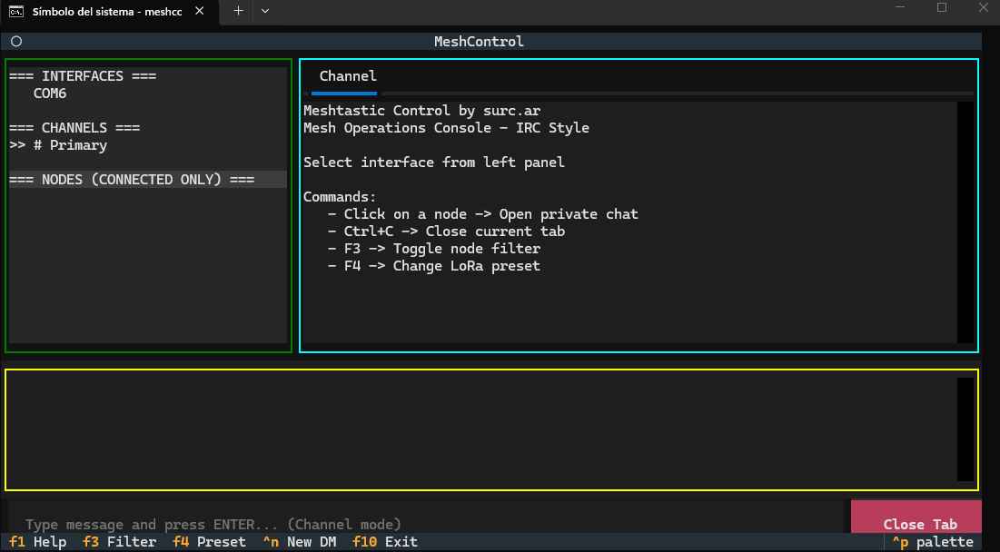
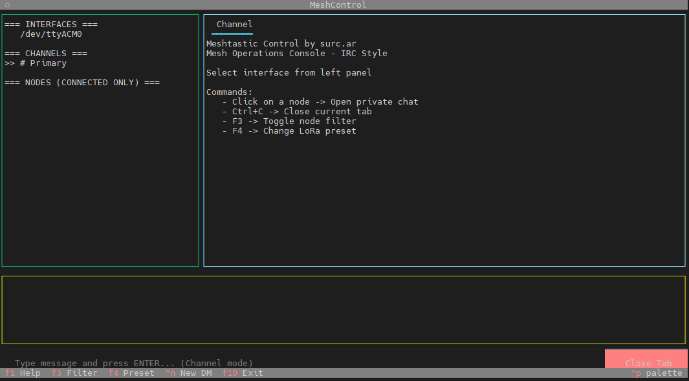

# Meshtastic Control by surc.ar

Minimalist IRC-style Meshtastic terminal client for:

- Raspberry Pi
- Linux
- Windows

---

# Screenshots

## Main Chat Interface



## Direct Messages




---

# Features

- IRC-style terminal interface
- Multi-tab chat system
- Direct Messages (DM)
- Meshtastic serial support
- Cross-platform serial detection
- Node browser
- LoRa preset selector
- Windows / Linux / Raspberry Pi support
- Lightweight terminal UI
- Built with Textual

---

# ⚠ Python Version Requirement

This project currently REQUIRES:

- Python 3.13

Python 3.15 is currently NOT supported because of upstream Meshtastic / WinRT Bluetooth dependencies on Windows.

---

# Installation (Windows)

## 1. Install Python 3.13

Download:

https://www.python.org/downloads/release/python-3139/

IMPORTANT during installation:

- Enable: `Add Python to PATH`

---

## 2. Install Meshtastic Control

```powershell
py -3.13 -m pip install --no-cache-dir meshtastic-control
```
## 3. Info
For more information go to luiszambrana.ar
Para más info encontrame en luiszambrana.ar